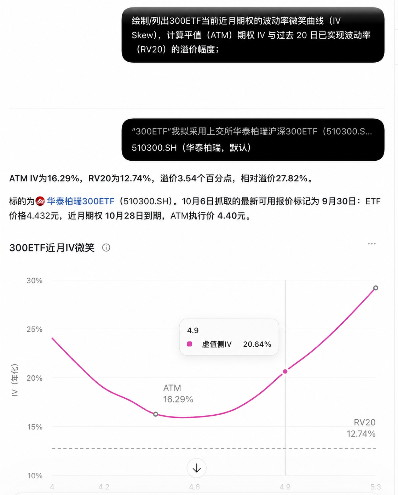
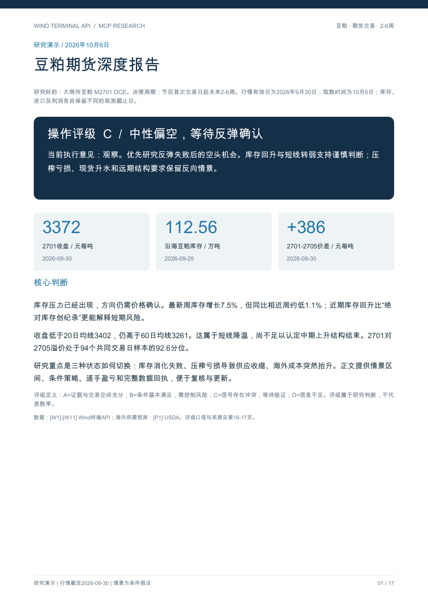
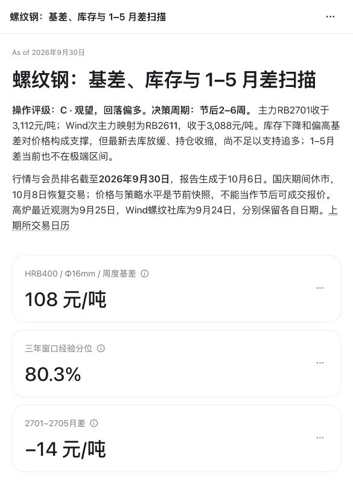

# Wind Terminal MCP · Wind 终端 API

**让 AI agent 使用你本机已授权的 Wind 数据，从取数走到可复核的研究。**

支持股票、债券、基金、指数、期货、期权、外汇、宏观与产业数据。通过标准本地 MCP 接入 Codex、Claude Code、Cursor、Gemini CLI、WorkBuddy 等 harness，提供参数发现、分批查询、原始回执、数据检查与本地分析。

[快速安装](#快速安装) · [三个研究示例](#三个研究示例) · [使用说明](USER_GUIDE.md) · [进阶期货演示](FUTURES_DEMOS.md) · [详细安装](INSTALL.md)

> 需要你自己的 Wind 桌面终端、官方 WindPy 和数据权限。开源的是 MCP 代码；Wind 数据与 SDK 的使用仍受你的 Wind 授权约束。服务来源标识固定为 `wind_terminal_api`，与 Alice MCP 独立。本项目为社区实现。

## 快速安装

### 最简单：给 agent 一段 prompt

先在本机安装并登录 Wind，准备 Python 3.10+（推荐 3.12）。然后在有文件和终端权限、支持本地 stdio MCP 的 harness 中复制：

```text
请从 https://github.com/spikewzy/wind-terminal-mcp 安装 Wind Terminal MCP 到本机独立目录。先读 README.md 和 INSTALL.md，检查系统、Python 与官方 WindPy；运行 install.py，把生成的 wind_terminal_api 配置合并到当前 harness，保留其他 MCP 设置。重载服务后调用 wind_capabilities 和 wind_status 检查，并用 510300.SH 最近一个已完成交易日的收盘价做一次小范围查询，展示实际日期、data_source_id 和 receipt_id。若需要我登录 Wind、指定 SDK 路径或重启客户端，说明具体一步；区分配置完成、服务可调用和真实取数成功。
```

agent 会完成下载、独立 Python 环境和客户端配置。Wind 登录、SDK 安装以及客户端要求的信任确认，可能需要你在界面中完成。纯云端聊天不能直接访问你本机 Wind。

### 自己安装：三条命令

macOS 或支持的信创桌面系统：

```sh
git clone https://github.com/spikewzy/wind-terminal-mcp.git
cd wind-terminal-mcp
python3 install.py
```

Windows 的第三条命令换为：

```powershell
py -3 install.py
```

找不到官方 SDK 时，在安装命令后加 `--wind-module-dir "实际包含 WindPy.py 的目录"`。例如 Windows：`py -3 install.py --wind-module-dir "D:\WindSDK\Python"`。无需从 pip 安装同名 WindPy 包。

**最后把生成的配置接入客户端并重载 MCP：**

| 你使用的 harness | 生成的文件 | 接入方式 |
| --- | --- | --- |
| Codex | `client-configs/codex.toml` | 合并到 `~/.codex/config.toml` |
| Claude Code | `client-configs/mcp.json` | 合并到项目 `.mcp.json` 的 `mcpServers` |
| Cursor | `client-configs/mcp.json` | 合并到项目 `.cursor/mcp.json` 或用户 `~/.cursor/mcp.json` |
| Gemini CLI | `client-configs/mcp.json` | 合并到 `.gemini/settings.json` 的 `mcpServers` |
| WorkBuddy | `client-configs/workbuddy.json` | 在「插件 → MCP 服务器 → 配置 MCP」合并服务器条目 |
| 其他本地 MCP 客户端 | `client-configs/mcp.json` | 按客户端格式填写 `command`、`args`、`env` |

只合并 `wind_terminal_api` 条目，保留现有服务器。安装器生成绝对路径，**不会自行修改 harness 的设置**；上面的安装 prompt 让 agent 完成合并。移动安装目录后重新安装并生成配置。

客户端格式依据：[Claude Code](https://code.claude.com/docs/en/mcp)、[Cursor](https://cursor.com/docs/mcp)、[Gemini CLI](https://geminicli.com/docs/tools/mcp-server/)、[WorkBuddy](https://www.codebuddy.cn/docs/workbuddy/From-Beginner-to-Expert-Guide/Function-Description/MCP-Guide)。配置兼容性与各客户端应用内实测分别记录。

### 安装后，问它第一句话

```text
使用 Wind 终端 API，检查 MCP 工具、平台和 Wind 登录状态。
查询 510300.SH 最近一个已完成交易日的收盘价，给出实际报价日期、
原始字段、来源标识和 receipt_id；不要把取数时间当成行情日期。
```

支持范围：**macOS、Windows、中科方德 5.0 桌面版、UOS 20 桌面版、银河麒麟 V10 SP1 桌面版**。macOS 有真实取数与下方报告证据；Windows 和列出的信创系统已做代码适配及模拟测试，仍需目标机器的官方 SDK、登录和取数验收。其他 Linux、其他版本及 Linux 服务器版暂不支持。

## 三个研究示例

以下是 **2026-10-06 生成的历史研究演示**，行情有效日主要为 **2026-09-30**。基本面序列各自保留观测日期。这些文件是固定成果，重新执行 prompt 会使用你账号能获得的数据。模型负责研究组织与图表/PDF生成，MCP 负责取数、证据和分析工具。

| 示例 | 复杂内容 | 查看成果 |
| --- | --- | --- |
| 300ETF 期权微笑 | 近月合约、执行价对齐、虚值侧 IV、ATM IV、RV20、波动率溢价 | [示例图片](docs/examples/300etf-iv-skew.png) |
| 豆粕深度研究 | 2–6 周操作评级、库存季节性、成本与压榨利润、持仓、跨期结构、多空情景与逐手盈亏 | [17 页 PDF · 21 张图](docs/examples/soybean-meal-deep-research-20261006.pdf) |
| 螺纹钢产业链与套利扫描 | 基差分位、四合约期限结构、库存/开工率、会员持仓、盈亏比与 1–5 月差 | [离线交互报告 · 16 张图 / 6 张表](docs/examples/rebar-deep-scan-20260930.html) |

HTML 报告需下载到本机并用浏览器打开；GitHub 文件页不会执行图表。三个案例的口径与复现要求见 [示例说明](docs/examples/README.md)。

### 1. 300ETF：波动率微笑与隐含波动率溢价

```text
使用 Wind 终端 API，绘制/列出 510300.SH 当前近月期权的波动率微笑曲线。
核对同一报价日与到期日，区分看涨、看跌和虚值侧 IV；
计算 ATM IV 与过去 20 个交易日已实现波动率 RV20 的差值及相对溢价。
保留深实值合约的零 IV 异常标记，说明年化和 ATM 选择方法，输出图与明细表。
```

本例：ATM IV **16.29%**，RV20 **12.74%**，差值 **3.54 个百分点**，相对溢价 **27.82%**。IV 使用 Wind 原生买卖中间价 IV；RV20 使用 20 个日对数收益、样本标准差与 `√252` 年化。两者的方法来源分别说明，不能将差值直接解释为卖期权收益。



### 2. 豆粕：把产业证据变成条件交易报告

```text
使用 Wind 终端 API，写一份大商所豆粕期货 2–6 周深度报告，交付 PDF。
包含操作评级、供需与库存季节性、进口/压榨成本、现货基差、期限结构和持仓变化；
给出多空三种情景、触发条件、失效条件、止损与逐手盈亏。
用图展示不同情景，区分原生数据、计算值和研究假设，并附来源和数据日期。
如需补充公开资料，独立标注来源，不混入 Wind 原始回执。
```

[打开豆粕完整 PDF](docs/examples/soybean-meal-deep-research-20261006.pdf) · [封面预览](docs/examples/soybean-meal-preview.png)

报告对 M2701.DCE 给出 **C / 中性偏空、等待反弹确认** 的条件评级。库存回升、压榨亏损和跨期升水放在同一框架比较，并用情景图、交易触发与逐手盈亏解释评级。海外供需预测单独标注 USDA 来源。



### 3. 螺纹钢：基差、产业链与跨期策略联合扫描

```text
使用 Wind 终端 API，对螺纹钢主力、次主力及产业链做深度扫描。
取近半年日收盘价，以上海 HRB400 现货计算基差及三年滚动分位；
抓取四个活跃合约的期限结构，判断升/贴水并计算月差与年化 Roll Yield；
比较近两个月高炉开工、螺纹社库、五大品种总库存与主力前20会员持仓变动；
评估多空盈亏比和 1–5 月差策略，输出可视化与来源表。
权限或字段不足时明确缺口；不同规格、日周频和不同来源不得静默拼接。
```

[下载完整螺纹钢 HTML 报告](docs/examples/rebar-deep-scan-20260930.html) · [报告预览](docs/examples/rebar-preview.jpg)

该例保留真实数据边界：HRB400 日度权限不足，独立使用 HRB400 周度基差 **108 元/吨、80.3% 分位**；HRB400E 日度基差另列，未将两者拼成历史。五大品种总库存来自独立标注的 Mysteel 公开发布。当前 1–5 月差 **−14 元/吨**，策略为观察与条件触发；报告没有用历史分位冒充胜率或无风险收益。



## MCP 的用处在哪里

**保留一次查询的证据，再让 agent 继续分析。** 发现参数、规划批次、取数、检查空值/日期、保存原始回执和派生计算形成连续流程，模型能够解释每个数字从哪里来。

| 能力 | 代表工具 | 你得到什么 |
| --- | --- | --- |
| 原生 Wind 读取 | `query_wind_data` | WSD / WSS / WSQ / WSI / EDB / WSET 等 19 类显式读取接口 |
| 参数与代码发现 | `search_wind_query_recipes`、`search_wind_fields`、`search_economic_indicator` | 已有查询范例、字段证据、需核验的候选 |
| 调用规划与预算 | `plan_wind_data_queries`、`wind_status` | 分批请求、估算数据格、本地原子预算及额度错误观察 |
| 回执与数据检查 | `read_wind_receipt` | 原始代码、字段、时间轴、数值与校验状态；保留空值和零的区别 |
| 本地序列与风险分析 | `analyze_wind_series`、`analyze_wind_risk` | 均线、动量、回撤、波动率、历史 VaR / ES；计算另存派生回执 |
| 截面与名单研究 | `screen_wind_universe`、`screen_wind_snapshot`、`aggregate_wind_snapshot` | 分批筛选、完整名单排序与分组汇总 |
| 产业序列与版本 | `combine_economic_series`、`compare_saved_edb_versions` | 显式公式、元信息和本服务已保存版本的比较 |

当前共 **26 个 MCP 工具**；工具名称、参数及平台限制以 `wind_capabilities` 和客户端发现的 schema 为准。通用取数不把本地字段清单当作白名单；实际可得数据由 Wind、SDK 版本与账号权限决定。

服务提供读取接口，不开放交易下单或任意 Python 执行。缓存默认为不复用（`max_age_seconds=0`）；回执、凭据与本机配置不会进入公开发行包。元信息保留 `data_source_id` / `data_source_name`，同时单独保留原始上游 `source`。

## 进一步使用

- [USER_GUIDE.md](USER_GUIDE.md)：首次查询、结果读取、缓存与预算、研究流程。
- [FUTURES_DEMOS.md](FUTURES_DEMOS.md)：代码映射、会员排名、仓单、EDB 和风险计算等进阶案例。
- [INSTALL.md](INSTALL.md)：SDK 路径、不同平台、客户端配置、离线安装与排错。
- [技能说明](skills/wind-terminal-api/SKILL.md)：给 agent 的可选工作指南；调用 MCP 无需安装 skill。
- [本机参考资料导入](docs/LOCAL_REFERENCES.md)：可选导入官方帮助与终端目录，增强文档/目录检索；公开仓库不附完整 Wind 文档或软件目录快照。

新安装的 EDB 元信息目录为空，可直接查询已确认代码，或用终端 WAI 找候选并核对口径。目录命中、连接成功和有数据权限是不同状态。额度错误后保留回执并停止自动重试；未知来源、单位、频率与历史版本保留未知。

## 开发与许可证

版本 **0.24.1**。源码采用 [MIT License](LICENSE)。第三方字段候选及报告内组件的许可说明见 [THIRD_PARTY_NOTICES.md](THIRD_PARTY_NOTICES.md)；MIT 不授予 Wind SDK、账号或数据的使用权。

离线单元测试（不连接 Wind）：

```sh
python3 -m unittest discover -s tests -v
```

安装后的通用 MCP 协议检查：

```sh
.venv/bin/python verify_delivery.py
```

Windows 使用 `.venv\Scripts\python.exe`。加 `--live` 会执行一次有限的真实查询；不加则不取 Wind 数据。目标平台与 harness 的实际接入须在对应环境验证。构建包含示例成果的源码 ZIP：`python3 build_release.py`。

欢迎通过 [Issues](https://github.com/spikewzy/wind-terminal-mcp/issues) 提供可复现的错误与脱敏参数，或提交 PR。请勿上传账号凭据、SDK 二进制或未授权的数据批量导出。

